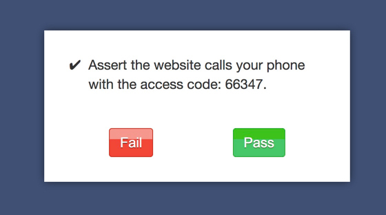
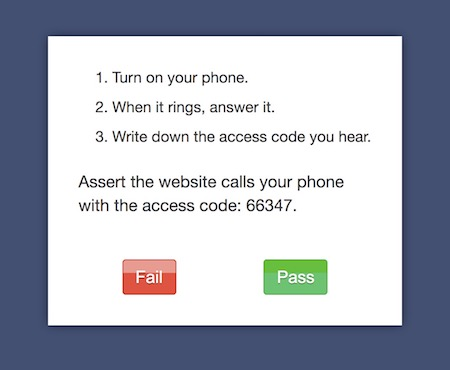
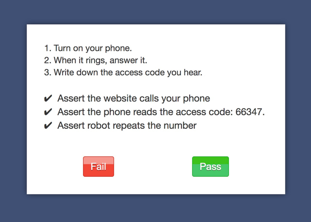

# Interactive Tests

Imagine you're testing a system that calls your user with an access code.  How do you assert such a thing?  You can use the `assertManual` method, which will display a manual assertion to be affirmed by the test observer by clicking either pass or fail.  The code for this is incredibly simple:

      /**
       * @interactive
       */
      public function testPhoneReceivedAccessCode() {
        $this->assertManual("Assert the website calls your phone with the access code: 66347.");
      }
      
When this method is called here's what the test observer will see in their browser, for the test to continue they will have to click one of the two buttons.

      

## Multiple Assertions

If you want you may have more than one assertion by sending an array instead:
      
      /**
       * @interactive
       */
      public function testPhoneReceivedAccessCode2() {
        $this->assertManual([
          'Assert the website calls your phone',
          'Assert the phone reads the access code: 66347.',
          'Assert robot repeats the number',
        ]);
      }
      
  
      
## Adding Instructions

You could rewrite the above code with some instructions to the user like the following. Take note that **markdown is supported** for the arguments passed to _::assertManual_.  This is very much related to [manual tests](@manual), in fact it's a hybridization of end to end and manual tests.

      /**
       * @interactive
       */
      public function testPhoneReceivedAccessCode() {
        $this->assertManual("Assert the website calls your phone with the access code: 66347.", [
          "Turn on your phone.",
          "When it rings, answer it.",
          "Write down the access code you hear.",
        ]);
      }

And it will render like so.

  

## Test Configuration

* Mark these classes or methods with `@interactive`
* To run these tests, the environment variable `TEST_INTERACTIVE=1` must be set.
