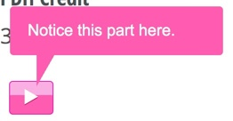
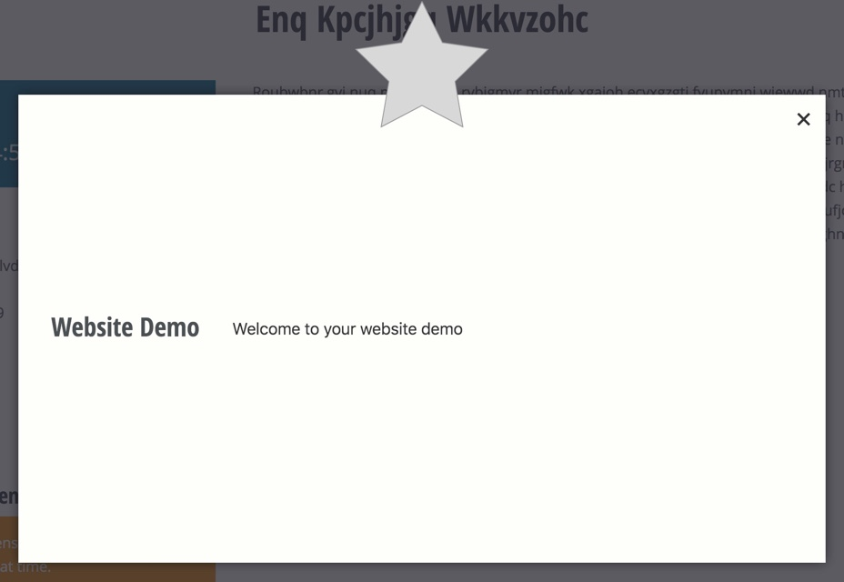

# Observation Mode

The idea here is that you can build a client demo using an end to end test, with very little extra work.  Then you may run the test in front of your client pausing as necessary to explain or discuss.  You must define the "breakpoints" in your test code using `::waitForObserver`.
  
You have the ability to run the test under observation mode which then stops at the defined breakpoints.  The following code illuminates this feature.

## Enable Observation Mode

At the very least you must call `::beginObservation`.  How you implement this is up to you.

The next practical requirement is that you call `::waitForObserver` at least once.

When in observation mode, the `body` of the document will have the class `is-being-observed`.  Additional observation-only CSS can be added, see below for more info.

### Toggle observation mode with ENV variables

* In this implementation, we expect an environment variable `TEST_DEMO` to be truthy when the test should be run in observation mode.  We detect and enable in `::setUp` as a means of running observation mode for all methods of the test class.

        public function onBeforeFirstTest() {
          if (getenv('TEST_DEMO')) {
            
            // The argument defines the button text.
            $this->beginObservation('Continue demo');
            
            // We can set the window size for observations.
            // 130 handles the top bar stuff.
            $this->getSession()->getDriver()->resizeWindow(1366, 1024 + 130);
          }
          parent::onBeforeFirstTest();
        }

* Read the docblocs for `::beginObservation` and `::endObservation` for more info.

## Adding a Demo "Breakpoint"

To pause the demo at the point just before a field has a value set on it, you would use something like the following:

        public function testSelectingMemberExposesMemberFields() {
          $el = $this->getDomElements([
           '.t-field_account_type',
          ]);
          
          // A button will be appended next to the element indicated by the argument
          // while in observation mode, otherwise this line of code does nothing.
          $this->waitForObserver('.t-field_account_type');
          
          $el['.t-field_account_type']->setValue('member');
        }

This is what is shown to the observer during the test run.

## Adding a Breakpoint Balloon

Here is a code example for adding an observation balloon, see `\AKlump\DrupalTest\Utilities\Balloon` for more info.

        $this->waitForObserver(
          Balloon::create('Notice this part here.')
            ->el('.t-interesting-div')
            ->before()
            ->delay(1)
        );

## Adding a Breakpoint Popup

The popup is a nice way to begin a demonstration, i.e., a title page.

The use of an icon is optional, but in this example you can see that we pass it an SVG string, which is defined as a class constant for easy reuse.  In practice you might define the CONST as a trait or super test class.

        <?php
        
        class WebsiteEndToEndTest extends AbstractEndToEndTest {
        
          const STAR = '<svg xmlns="http://www.w3.org/2000/svg" width="267" height="254" viewBox="0 0 267 254"><polygon fill="#D8D8D8" fill-rule="evenodd" stroke="#979797" points="133.5 209.75 52.092 252.549 67.639 161.899 1.779 97.701 92.796 84.476 133.5 2 174.204 84.476 265.221 97.701 199.361 161.899 214.908 252.549"/></svg>';
        
          public function testCanLoadHomepage() {
            $this->loadPageByUrl('/');
        
            $this->waitForObserver(
              Popup::create("Welcome to your website demo")
                ->setTitle('Website Demo')
                ->setIcon(self::STAR)
            );
          }
          
        }

## Add Custom CSS During Observation Mode

* The body will have the additional class `.under-observation`.
* You can attach custom CSS by doing something such as:

      public function onBeforeFirstTest() {
        $css = ".observe__center {top: 10%}";    
        $this->attachObservationCss($css);
      }

