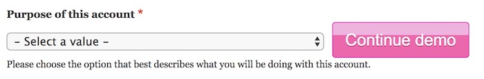

# Observation Mode

The idea here is that you can build a client demo using an end to end test.  Then you may run the test in front of your client pausing as necessary to explain or discuss.  You must define the "breakpoints" in your test code using `::waitForObserver`.  You have the ability to run the test either in demonstration mode or not.  The following code illuminates this feature.

## Enable Observation Mode

At the very least you must call `::beginObservation`.  How you implement this is up to you.  At some point after that in the test class you should call `::waitForObserver` one or more times.

### Toggle observation mode with ENV

* In this implementation, we use the environment variable to be able to toggle the observation mode on or off, in this way you can run this as a test or a demo.  We do it in `::setUp` as a means of running observation mode throughout the entire test.

        public function setUp() {
          if (getenv('TEST_DEMO')) {
          
            // The argument defines the button text.
            $this->beginObservation('Continue demo');
          }
        }

* Read the docblocs for `::beginObservation` and `::endObservation` for more info.

## Adding a Demo "Breakpoint"

To pause the demo at the point just before a field has a value set on it, you would use something like the following:

        public function testSelectingMemberExposesMemberFields() {
          $el = $this->getDomElements([
           '.t-field_account_type',
          ]);
          
          // A button will be appended next to the element indicated by the argument
          // while in observation mode, otherwise this line of code does nothing.
          $this->waitForObserver('.t-field_account_type');
          
          $el['.t-field_account_type']->setValue('member');
        }

This is what is shown to the observer during the test run.

## Add Custom CSS During Observation Mode

* The body will have the additional class `.under-observation`.
* You can attach custom CSS by doing something such as:

      public function onBeforeFirstTest() {
        $css = ".observe__center {top: 10%}";    
        $this->attachObservationCss($css);
      }
